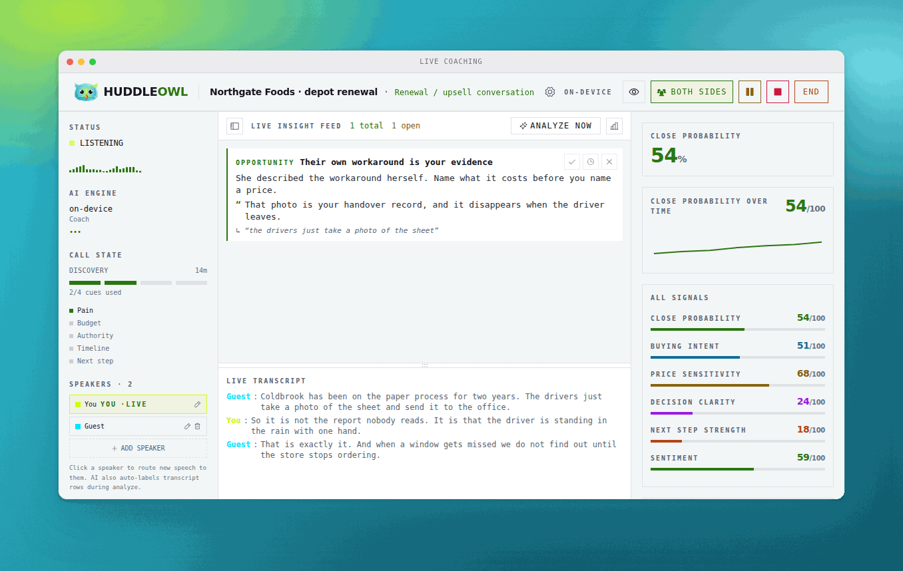
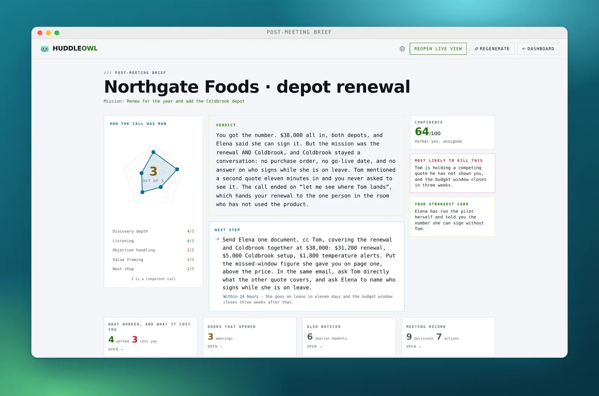
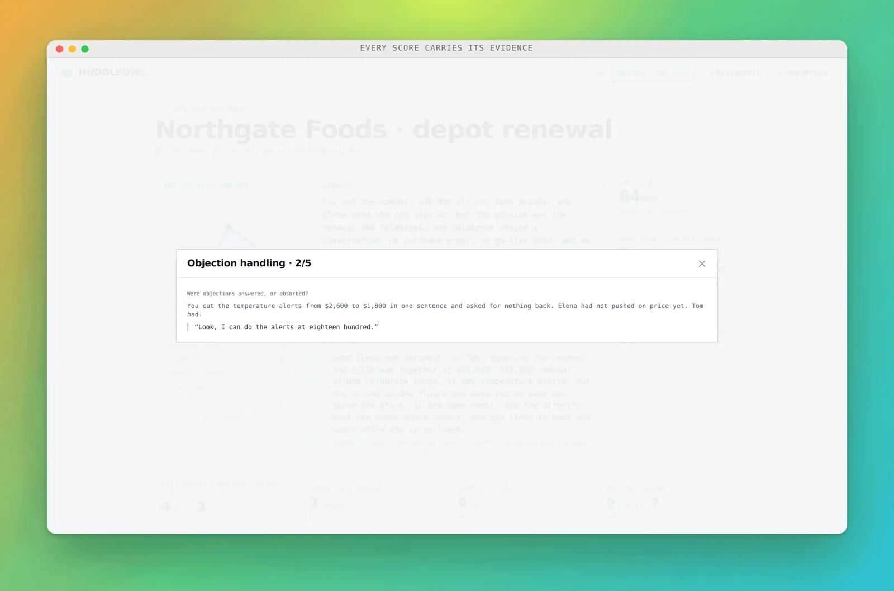
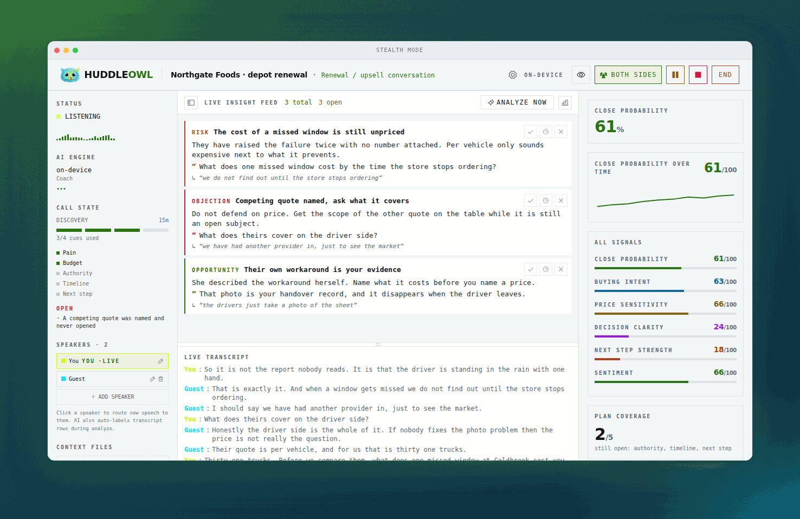
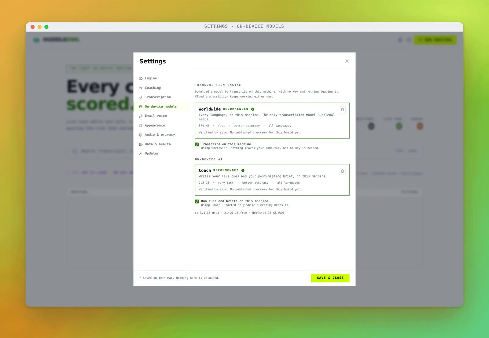

<div align="center">


# HuddleOwl

### The only AI meeting assistant that helps you win the call while you are still in it.

**A card appears while you are still talking, quoting the line that triggered it: the objection you talked past, the question you skipped, the buying signal you missed. Then a scored review of how you ran it, about forty seconds after you hang up.**

Every other tool in this category tells you afterwards. By then it is a transcript, not a chance.

Nothing joins the call. No account, no sign up. On a Mac with the on-device models, nothing leaves your laptop at all.

<br/>


<br/>

### [&nbsp;&nbsp;**DOWNLOAD FOR MAC**&nbsp;&nbsp;](https://github.com/IshanVats-6/huddleowl/releases/download/v0.1.9/HuddleOwl-0.1.9-arm64.dmg)

<sub>Apple Silicon, 164 MB&nbsp; · &nbsp;[Intel Mac](https://github.com/IshanVats-6/huddleowl/releases/download/v0.1.9/HuddleOwl-0.1.9.dmg)&nbsp; · &nbsp;[Windows](https://github.com/IshanVats-6/huddleowl/releases/download/v0.1.9/HuddleOwl-0.1.9-win-x64.exe)&nbsp; · &nbsp;[All files and checksums](https://github.com/IshanVats-6/huddleowl/releases/latest)</sub>

<br/>



<sub>Cards arrive while you are still talking. Every one of them quotes the line that triggered it.</sub>

</div>

---

## Your notetaker remembers the meeting. This makes you better at the next one.

A notetaker hands you this:

> Discussed pricing and timeline. Client raised some budget concerns. Agreed to follow up next week.

HuddleOwl hands you this:

| | | |
|---|:---:|---|
| **Next step** | `1/5` | Call ended on "let's stay in touch". No date, no owner. |
| **Objection** | `2/5` | "It's a lot for a team our size" went unanswered. |
| **Discovery** | `3/5` | You moved to price 40 seconds after they said "budget", and never came back to what the delay costs them. |

> **Practise this next:** ask what a problem costs before you price the solution.

---

## The brief, about 40 seconds after you hang up

Not a summary. A scored rubric for the role you were playing, a verdict, and the one next step that matters. Sales is graded on discovery depth, listening, objection handling, value framing and next step. PM, recruiter and product each get their own rubric. A dimension the call never tested is left unscored, never quietly given a zero.

<div align="center">

</div>

It reads the **whole** transcript, not the last few minutes that happen to fit in one context window, and the chunking never splits a speaking turn, so a quote is never half a sentence.

---

## Every score carries the sentence that earned it

The scorecard does not tell you to work on discovery. It says 3 out of 5, and here is the line you said. A cue that cannot point at the sentence it is reacting to is discarded before you ever see it.

<div align="center">

</div>

You can disagree with a score, which is the whole point. You cannot disagree with a transcript.

---

## Coaching nobody else in the call can see

Not dimmed, not minimised. The overlay does not appear in the recording, the Zoom share or the Loom. Clicks pass straight through to whatever is underneath, so you keep working with it sitting on top, and `⌘⇧H` brings it back from anywhere if you lose it.

<div align="center">

</div>

---

## The whole thing runs with the wifi off

Live transcription, live coaching, the brief, the follow-up email. Download a model once and HuddleOwl needs nothing from anyone: no account, no API key, no network. Not a degraded offline mode, the same rubric and the same evidence quotes.

<div align="center">

</div>

> [!NOTE]
> **On-device engines ship on macOS today.** On Windows, HuddleOwl runs against a cloud model of your choosing while the local engines are being built. This page will say so the day that changes, and not before.

Prefer a cloud model anyway? Point it at over 100 providers or at your own endpoint and pay your provider directly. There is no per-seat AI markup from us.

---

## Install

### macOS

1. Download the build for your chip. Apple Silicon is the big link above; there is a separate Intel build beside it.
2. Open the `.dmg` and drag HuddleOwl into Applications.
3. macOS will say the app is damaged. It is not. HuddleOwl is not notarised with Apple yet, which is a signing formality rather than anything about the build. Run this once in Terminal, then open it again:

```bash
xattr -cr /Applications/HuddleOwl.app
```

Notarisation is on the list.

### Windows

1. Download the `.exe` and run it.
2. SmartScreen will ask once, because the build is unsigned. Choose **More info**, then **Run anyway**.

### Verifying your download

Every release carries `SHA256SUMS.txt`.

```bash
# macOS or Linux
shasum -a 256 -c SHA256SUMS.txt --ignore-missing

# Windows
certutil -hashfile HuddleOwl-0.1.9-win-x64.exe SHA256
```

---

## Questions people ask

<details>
<summary><b>Does anything join my call?</b></summary>
<br/>

No. There is no bot, no extra participant and no calendar connection. HuddleOwl listens to your microphone and your system audio on your own machine, so nobody on the call sees anything different.

</details>

<details>
<summary><b>Does my audio leave my machine?</b></summary>
<br/>

On a Mac with the on-device models selected, no. Nothing, at all, including with the wifi off. If you choose a cloud model instead, your transcript goes to the provider you picked, using your key, directly from your machine. It never passes through us, because there is no server of ours for it to pass through.

</details>

<details>
<summary><b>Is it really free?</b></summary>
<br/>

Yes, for individuals, permanently. No card, no trial clock, no feature held back to sell you later.

</details>

<details>
<summary><b>Where is my data kept?</b></summary>
<br/>

In a folder on your disk that you can open from inside the app. Transcripts, cues, briefs and draft emails all live there. Delete the folder and there is nothing left anywhere.

</details>

<details>
<summary><b>Which models does it run?</b></summary>
<br/>

A Whisper-family transcription model and a local coaching model, both downloaded once from inside the app. Together they are about 3GB and want 8GB of RAM. Or point it at any of 100+ cloud providers, or at your own endpoint.

</details>

<details>
<summary><b>Is stealth mode above board?</b></summary>
<br/>

It hides the coaching overlay from your screen share so the person you are talking to does not watch you being coached. It does not hide that you are recording, and it does not touch anything on their side. Recording law is yours to follow where you are.

</details>

<details>
<summary><b>Can I import a recording I already have?</b></summary>
<br/>

Yes. Drop in an audio file and it comes back with the same transcript, the same rubric and the same evidence quotes as a live call.

</details>

---

## About this repository

This repository holds the installers and nothing else. It exists so that downloads have a public home while the application's own source stays private. Everything here is attached to a [release](../../releases).

HuddleOwl is built on other people's work, nearly all of it under permissive licences that ask only that their copyright notice travels with the binary. Every bundled component, its licence and its copyright holder are listed in [THIRD-PARTY-NOTICES.md](THIRD-PARTY-NOTICES.md), generated from the real dependency metadata rather than written by hand.

Found a bug, or want something it does not do yet? [Open an issue](../../issues). Every one of them is read.

<div align="center">
<br/>

**If HuddleOwl catches something on your next call that you would have missed, a star helps the next person find it.**

<br/>
</div>

<details>
<summary><b>Publishing a build (maintainers)</b></summary>
<br/>

Actions, **Publish a build**, Run workflow. Give it the version (`0.1.9`) and the release in the app repo to take the files from (`dev-latest`). It pulls the three installers, writes `SHA256SUMS.txt`, publishes the release, and rewrites the version everywhere in this README, all inside GitHub's network.

It needs one secret, once: a fine-grained personal access token with **Contents: Read-only** on `huddleowl-app` and nothing else, saved here under Settings, Secrets and variables, Actions, as `APP_REPO_TOKEN`. The setup notes at the top of `.github/workflows/mirror-release.yml` spell it out.

Nothing has to be edited afterwards. huddleowl.com asks this repository for its latest release at build time and derives the version, the three links and the three file sizes from the answer, and the last step of the workflow pokes Netlify to rebuild. Set `NETLIFY_BUILD_HOOK` here to make that immediate; without it the site picks the new version up on its next deploy.

</details>
